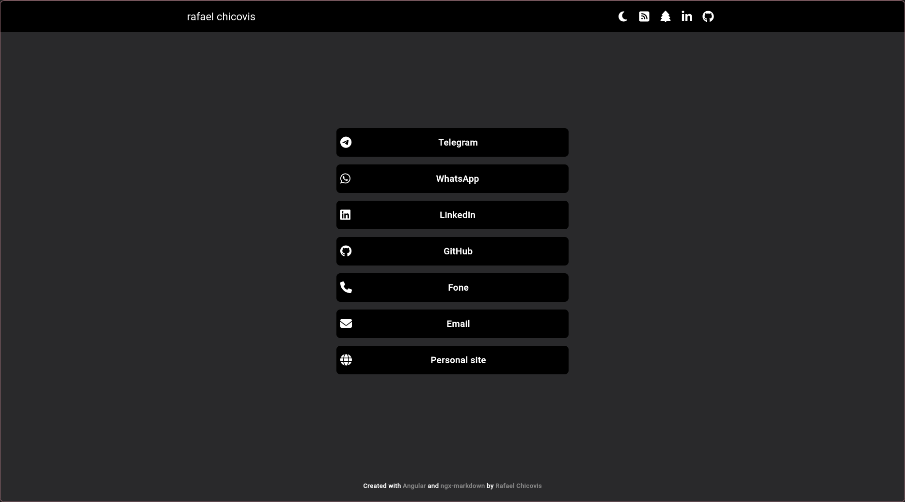

# RafaelChicovisBlog

In [English](README.md) | Em [Português](shares/README_PTBR.md)

---

A simple, markdown-based personal blog to share knowledge and experiences.

||   |
|-------------------------------------|--------------------------------------|
||   |
|  |

> You can see this site in production [here](https://rafael-chicovis-blog-front.onrender.com/)!

## Features
* Responsive Design;
* Create Posts with Markdown;

## Tech Stacks
### **Frontend**
* [Angular v18;](https://angular.dev)
* [Angular Material;](https://material.angular.io)
* [PrimeNg;](https://primeng.org)
* [Ngx-markdown;](https://jfcere.github.io/ngx-markdown/get-started)
* [Fontawesome](https://fontawesome.com)


### **Backend** 
* [.NET v9](https://dotnet.microsoft.com/en-us/);
* [Supabase](https://supabase.com);

### **Database**
* [PostgreSQL](https://www.postgresql.org) on Supabese;

### **Hosting** 
* [Render](https://dashboard.render.com)

## Run this project
### Run front end
#### Requirements
* Node.js (up to v18): [Install Here;](https://nodejs.org/en)
* Angular CLI (up to v18): run this command:
```bash
npm install -g @angular/cli
```
#### Step by step
* Clone the project and install packages:
```bash
git clone https://github.com/RafaelKC/rafael-chicovis-blog.git && \
cd ./rafael-chicovis-blog && \
npm i
```
* Run server
```bash
 ng serve
```

### Run front end
#### Requirements
* .NET 9: [Install Here;](https://dotnet.microsoft.com/en-us/download/dotnet/9.0)
* [Supabase](https://supabase.com);

#### Step by step
* On project repository:
```bash
cd ./Backend/RafaelChicovisBlog
```
* Configure Supabase on _appsettings.Development.json_;
* Run backend:
```bash
dotnet run
```
* Configure backend URL on _environment.ts_.
