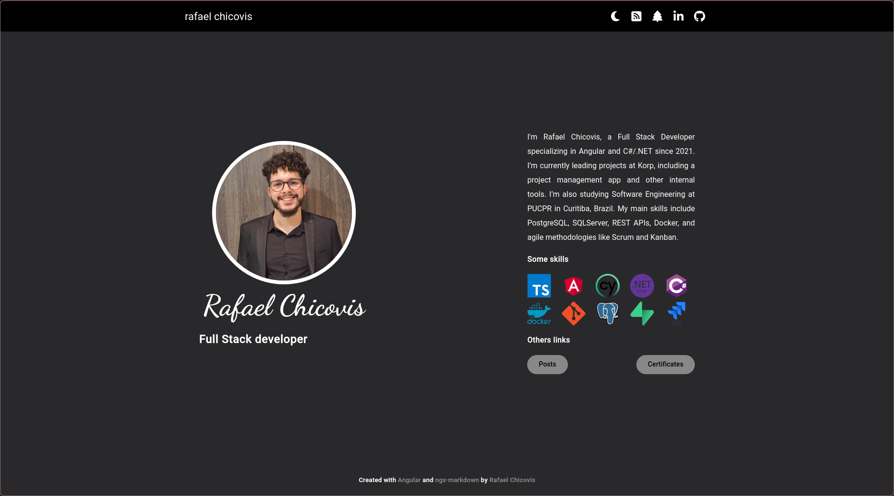
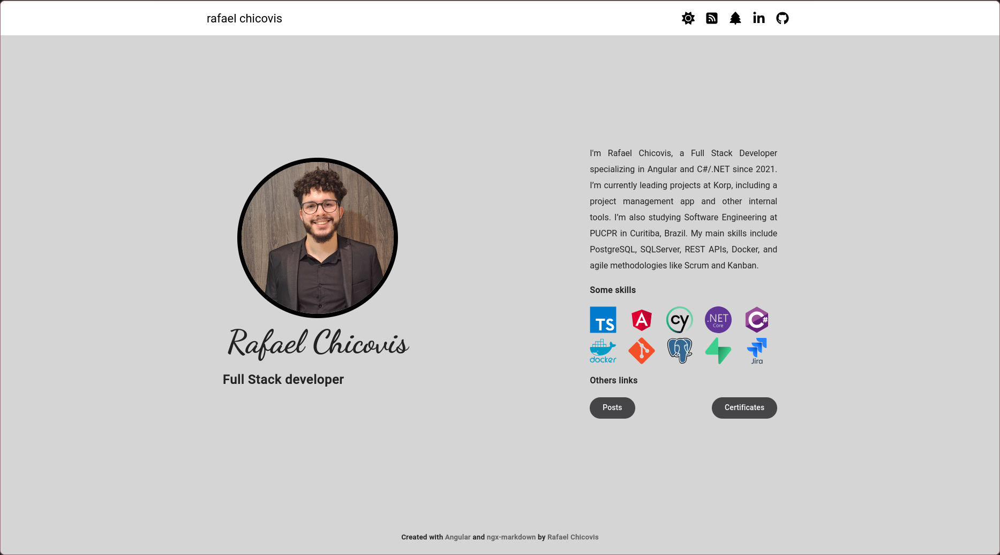
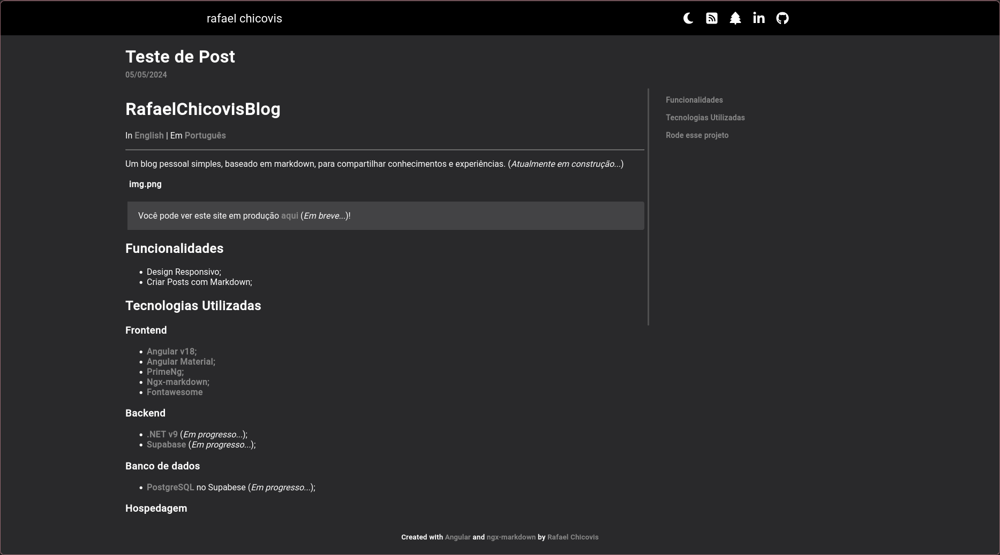
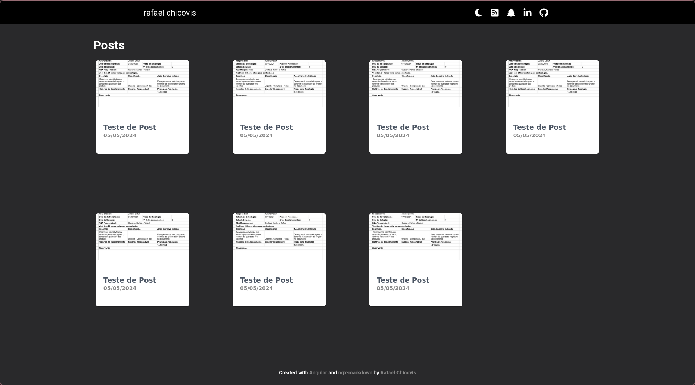
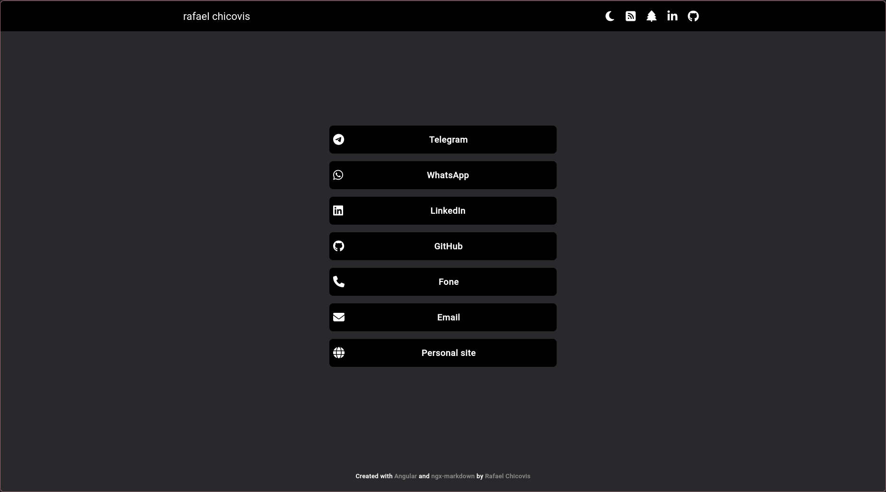

# RafaelChicovisBlog

In [English](../README.md) | Em [Português](README_PTBR.md)

---

Um blog pessoal simples, baseado em markdown, para compartilhar conhecimentos e experiências.

||   |
|-------------------------------------|--------------------------------------|
||   |
|  |

> Você pode ver este site em produção [aqui](https://rafael-chicovis-blog-front.onrender.com/)!

## Funcionalidades
* Design Responsivo;
* Criar Posts com Markdown;

## Tecnologias Utilizadas
### **Frontend**
* [Angular v18;](https://angular.dev)
* [Angular Material;](https://material.angular.io)
* [PrimeNg;](https://primeng.org)
* [Ngx-markdown;](https://jfcere.github.io/ngx-markdown/get-started)
* [Fontawesome](https://fontawesome.com)


### **Backend**
* [.NET v9](https://dotnet.microsoft.com/en-us/);
* [Supabase](https://supabase.com);

### **Banco de dados**
* [PostgreSQL](https://www.postgresql.org) no Supabese;

### **Hospedagem**
* [Render](https://dashboard.render.com)

## Rode esse projeto
### Rode o frontend
#### Requisitos
* Node.js (acima da v18): [Instale aqui;](https://nodejs.org/en)
* Angular CLI (acima da v18): rode esse comando:
```bash
npm install -g @angular/cli
```
#### Step by step
* Clone o repositório e instale os pacotes:
```bash
git clone https://github.com/RafaelKC/rafael-chicovis-blog.git && \
cd ./rafael-chicovis-blog && \
npm i
```
* Rode o servidor
```bash
 ng serve
```

### Run front end
#### Requirements
* .NET 9: [Install Here;](https://dotnet.microsoft.com/en-us/download/dotnet/9.0)
* [Supabase](https://supabase.com);

#### Step by step
* No repositório do projeto:
```bash
cd ./Backend/RafaelChicovisBlog
```
* Configure o Supabase no _appsettings.Development.json_;
* rode o backend:
```bash
dotnet run
```
* Configure o backend URL no do front _environment.ts_.


