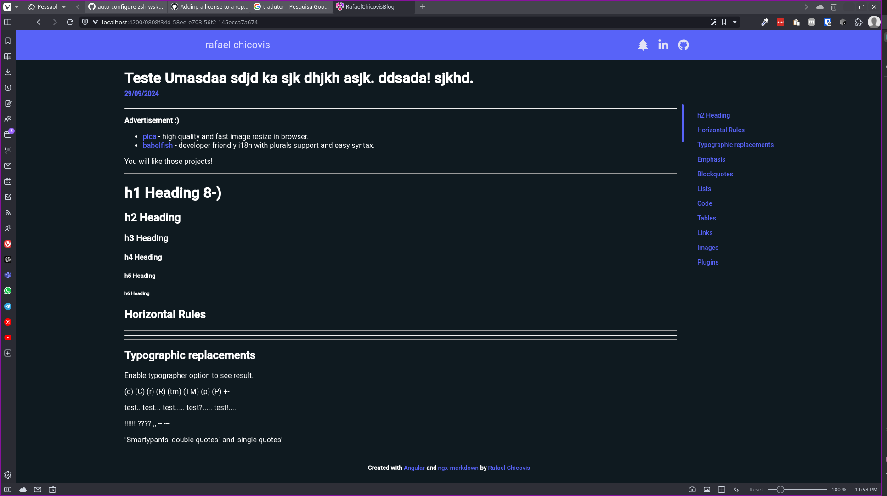

# RafaelChicovisBlog

In [English](../README.md) | Em [Português](README_PTBR.md)

---

Um blog pessoal simples, baseado em markdown, para compartilhar conhecimentos e experiências. (*Atualmente em construção...*)

|  |   |
|---------------------------------|-------------------------------|

> Você pode ver este site em produção [aqui]() (*Em breve...*)!

## Funcionalidades
* Design Responsivo;
* Criar Posts com Markdown;

## Tecnologias Utilizadas
### **Frontend**
* [Angular v18;](https://angular.dev)
* [Angular Material;](https://material.angular.io)
* [PrimeNg;](https://primeng.org)
* [Ngx-markdown;](https://jfcere.github.io/ngx-markdown/get-started)
* [Fontawesome](https://fontawesome.com)


### **Backend**
* [.NET v9](https://dotnet.microsoft.com/en-us/) (*Em progresso...*);
* [Supabase](https://supabase.com) (*Em progresso...*);

### **Banco de dados**
* [PostgreSQL](https://www.postgresql.org) no Supabese (*Em progresso...*);

### **Hospedagem**
* [GitHub Pages](https://pages.github.com)

## Rode esse projeto
### Rode o frontend
#### Requisitos
* Node.js (acima da v18): [Instale aqui;](https://nodejs.org/en)
* Angular CLI (acima da v18): rode esse comando:
```bash
npm install -g @angular/cli
```
#### Step by step
* Clone o repositório e instale os pacotes:
```bash
git clone https://github.com/RafaelKC/rafael-chicovis-blog.git |
cd rafael-chicovis-blog |
npm i
```
* Rode o servidor
```bash
 ng serve
```


